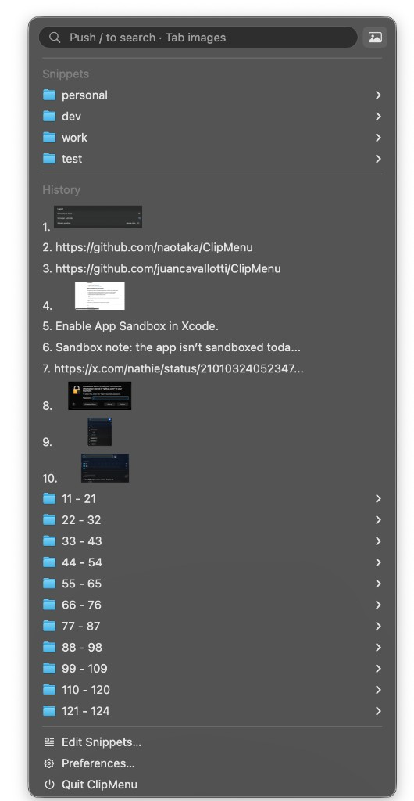

#  ClipMenu

ClipMenu is a macOS clipboard manager rebuilt in Swift (SwiftUI + SwiftData).

## Installation

- **Mac App Store** (when published): search for ClipMenu, or install from your listing.
- **Direct download**: get the latest **ClipMenu-*.dmg** from [GitHub Releases](https://github.com/Frazer/ClipMenu/releases/latest)

Open the DMG and drag `ClipMenu.app` into Applications.

App Store installs update through the App Store. Direct downloads update in-app via Sparkle (**Preferences → About**).

## New Features

Features added since forking this modernization:

- **Cascading Actions menu** — hold the Actions modifier (default ⌘) while choosing a clip or snippet to open actions beside ClipMenu; a single action runs immediately
- **In-app JavaScript action editor** — view bundled scripts, edit user scripts, and copy templates into your User’s folder
- **Inline action renaming** and full-name hover tooltips in Preferences → Actions
- **Slash filter** — press `/` to search without jumping rows; **Tab** or the photo button for images-only history
- **Stable popup width** when toggling the images-only filter
- **Clip previews** beside the menu and submenus, with smarter placement (including when a submenu is open)
- **Smart popup positioning** — opens above the cursor when triggered on the bottom half of the screen; submenu direction respects which side of the screen you’re on
- **Snippets prefs UX** — reliable folder/snippet selection, instant rename on add, and title mirrored into empty content while naming
- **Multi-digit history numbering** in the main popup (10, 11, … instead of wrapping at 9)
- **Remove apps from the ignore list** in Preferences
- **About & Updates** preferences tab — GitHub / United Visions links; Sparkle updates for direct downloads; App Store update check for the store build
- **Dual distribution** — `ClipMenu` (GitHub DMG + Sparkle) and `ClipMenuAppStore` (sandbox) schemes, with a DMG release script and GitHub Actions workflow

A complete migration from the old architecture to run on Mac M chips thanks to [Juan Cavallotti](https://github.com/juancavallotti/ClipMenu).

### Actions shortcut

In **Preferences → Actions**, choose a modifier key (default **Command**). Hold that key while selecting a clip or snippet to open the action menu. If only one action is available, it runs immediately instead of showing the menu.

## Huge Thanks

A huge thank you to [Naotaka Morimoto](https://github.com/naotaka/ClipMenu), the original author of ClipMenu.

ClipMenu has helped many users for years, and this modernization work stands on top of that original design and effort.

Thanks also to [Juan Cavallotti](https://github.com/juancavallotti/ClipMenu) for the Mac M-chip port that this work builds on.

## Distribution Note

If you distribute derived work:

1. Do not use `ClipMenu` as your product name.
2. Follow the MIT license terms.

## License

ClipMenu is available under the MIT license. See `LICENSE` for details.
