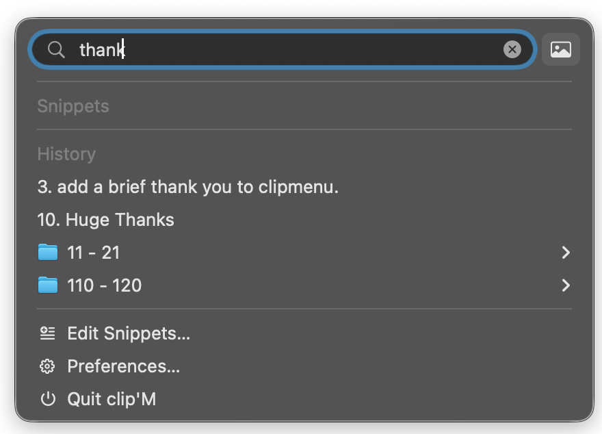
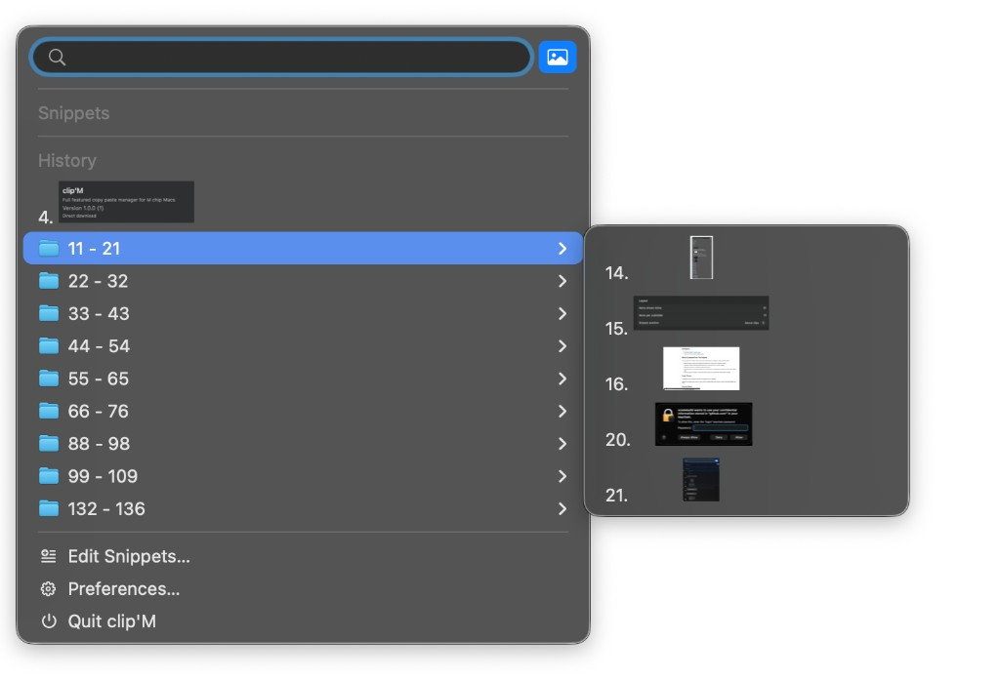
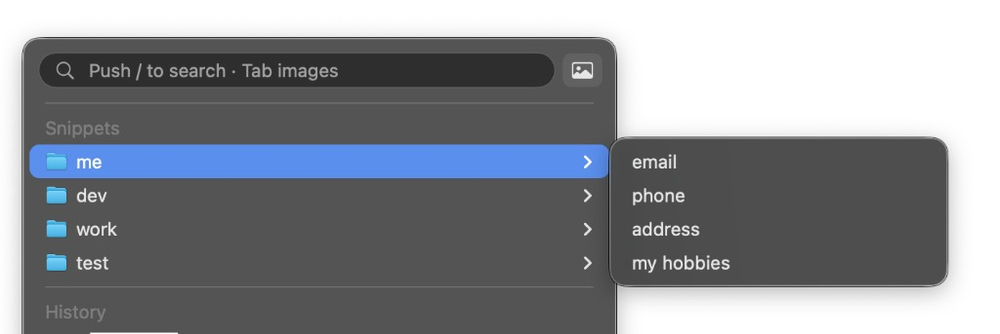

#  clip'M

**Your clipboard, finally easy to use.**

A full-featured copy & paste manager built for Apple silicon M‑chip Macs — search history, preview clips, and paste the right thing in a flash.

## Installation

- **[Mac App Store](https://apps.apple.com/app/id6757437982)**
- **Direct download**: latest **clipM-*.dmg** from [GitHub Releases](https://github.com/Frazer/clipM/releases/latest)

Open the DMG and drag **clip'M** into Applications.

App Store installs update through the App Store. Direct downloads update in-app via Sparkle (**Preferences → About**).

## Features

### Search

Press `/` and start typing. clip'M filters your history instantly so you can find the clip you need without scrolling.

Need screenshots only? Press `/` then `Tab`, or click the image button, for **image-only search**.

  
  &nbsp;
  

### Previews

Hover a clip or open a history group and a live preview appears beside the menu — so you see text, screenshots, and documents before you paste.

### Snippets

Organize reusable text into folders (email, phone, addresses, boilerplate) and open them from the same menu as clipboard history.

  

### Actions

Transform a clip before you paste it. Built-in actions cover everyday jobs like **uppercase / lowercase** and **URL decoding**. You can also add **user-programmed actions** and plug them into the same menu.

## Built for M‑series Macs

The original [ClipMenu](https://www.clipmenu.com) was a favourite for a decade: simple, fast, and always there when you needed it. Here it is ported to run natively on Apple silicon, with great new features like search, image-only filtering, and live previews layered on top of what made ClipMenu great.

A complete migration from the old architecture thanks to [Juan Cavallotti](https://github.com/juancavallotti/ClipMenu).

## Huge Thanks

A huge thank you to [Naotaka Morimoto](https://github.com/naotaka/ClipMenu), the original author of ClipMenu.

ClipMenu has helped many users for years, and this modernization work stands on top of that original design and effort.

Thanks also to [Juan Cavallotti](https://github.com/juancavallotti/ClipMenu) for the Mac M‑chip port that this work builds on.

## From United Visions

clip'M was developed by team members from [United Visions](https://unitedvisions.org) — all about empowering you to copy the best ways of being, and paste that awesomeness all over the world.

Please enjoy the software. And remember to be careful with the thoughts and feelings you practice every day.

## Distribution Note

If you distribute derived work:

1. Do not use `ClipM` or `ClipMenu` as your product name.
2. Follow the MIT license terms.

## License

clip'M is available under the MIT license. See `LICENSE` for details.
